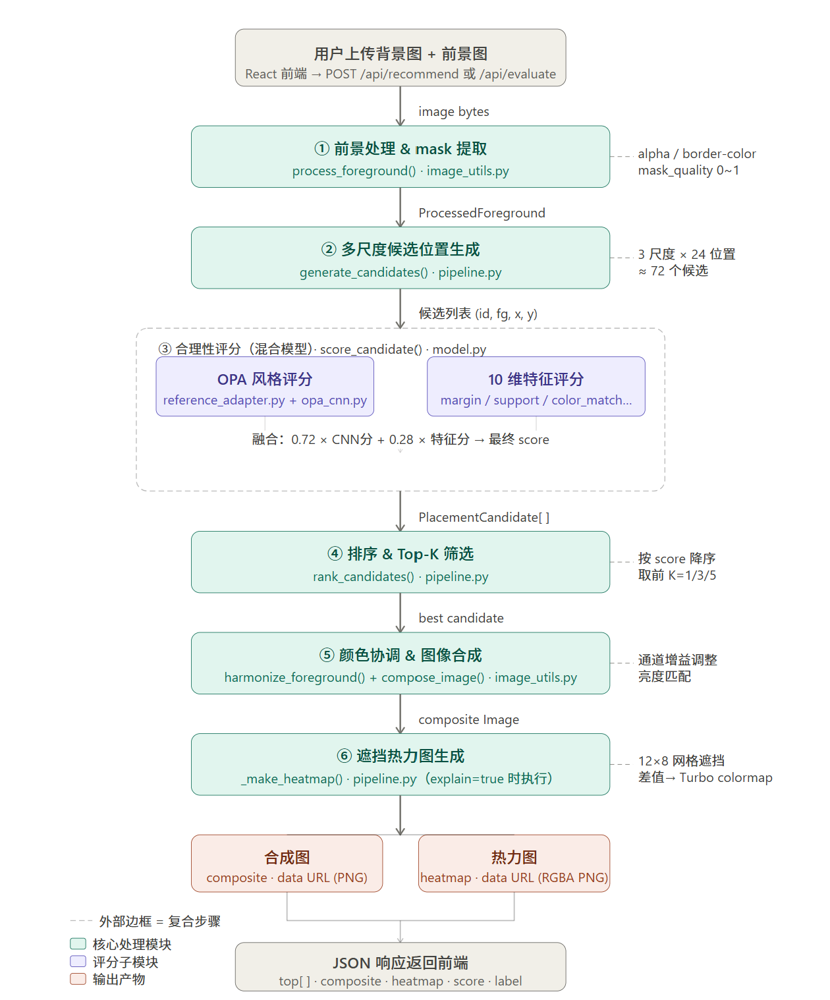
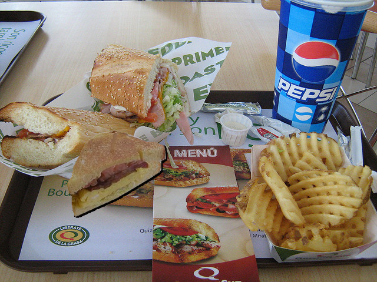
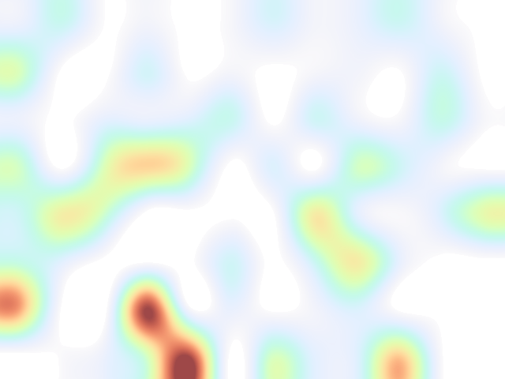
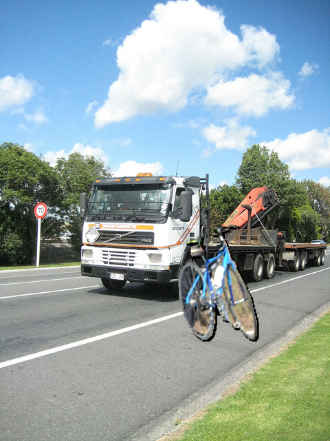
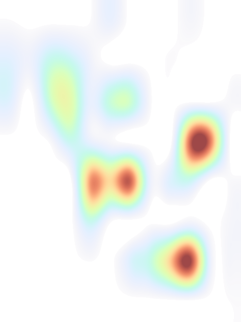
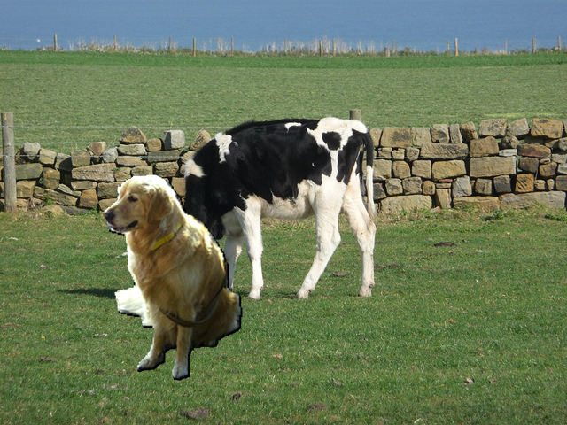
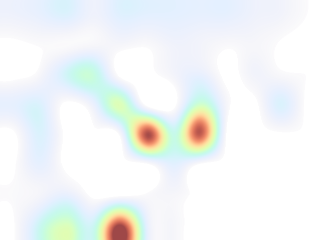
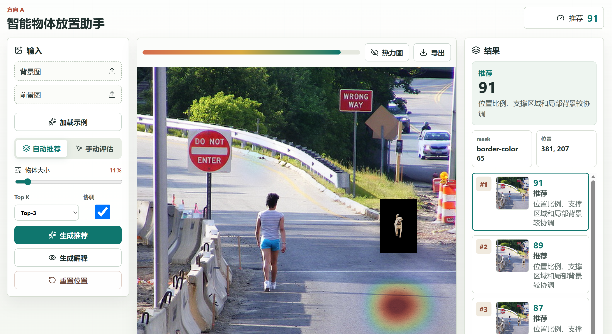
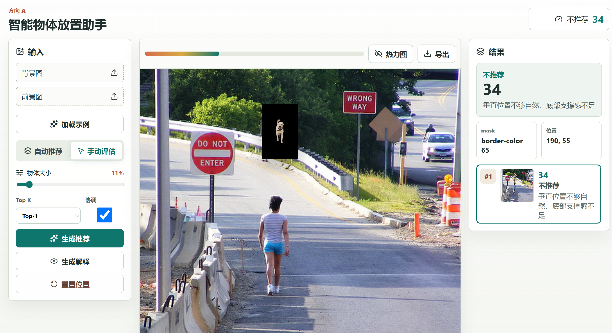
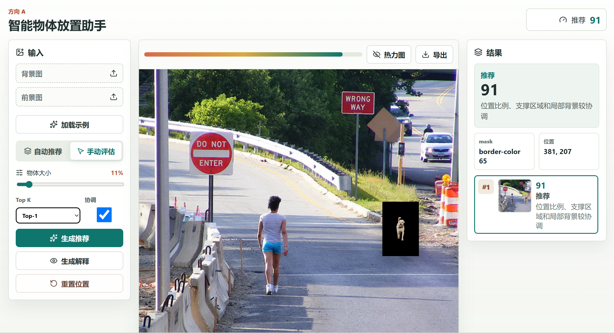

# 工科创二大作业实验报告: 智能物体放置助手

> 基于方向 A - OPA / TopNet / libcom 的前景物体放置合理性评估与推荐系统

---

## 一、模型

### 1.1 模型改造

本项目在参考 OPA/SimOPA 原始模型的基础上，完成了三处本体类改动，分别针对输入形式、输出形式和模型规模。

#### 1.1.1 输入改造：RGB → RGB + mask（4 通道输入）

**改动前：** 原始 OPA/SimOPA 以纯 RGB 合成图作为输入（3 通道），模型只能通过像素颜色隐式推断前景边界，无法直接感知前景物体的形状与位置。

**改动后：** 将输入扩展为 RGB + mask 的 4 通道张量，mask 通道明确编码前景物体的精确边界。

```
[R, G, B]  →  [R, G, B, mask]
shape: (3, H, W)  →  shape: (4, H, W)
```

**改动位置：**

- `backend/app/reference_adapter.py`：`build_opa_style_input()` 构建 4 通道输入张量
- `backend/app/opa_cnn.py`：CNN 第一层改为 `nn.Conv2d(4, width, ...)`，接收 4 通道输入
- `training/opa_dataset.py`：数据集加载时将 RGB 与 mask 拼接为 4 通道 tensor

**改动原因：** 让模型在评分时不仅依赖颜色信息，还能明确感知前景边界，从而更准确地判断边界处与背景的融合质量。

---

#### 1.1.2 输出改造：二分类 → 连续分数 + 三档标签

**改动前：** 原始 OPA/SimOPA 输出二分类标签（0 = 不合理，1 = 合理），无法区分"勉强可用"和"明显合理"的情况。

**改动后：** 分两个层次改造输出：

**模型层**：移除 argmax 分类，在 logit 后接 sigmoid，输出 0~1 连续合理性分数：

```python
score = torch.sigmoid(logit).item()  # 连续分数，范围 [0, 1]
```

**应用层**：将连续分数映射为三档语义标签，便于用户直观理解：

| 分数区间 | 标签 |
|----------|------|
| ≥ 0.74 | 推荐 |
| 0.52 ~ 0.74 | 可接受 |
| < 0.52 | 不推荐 |

**改动位置：** `backend/app/model.py` 的 `_label()` 函数

---

#### 1.1.3 模型缩小：ResNet50 → TinyOPAConvNet（4 层小 CNN）

**改动前：** 原始 OPA 参考模型以 ResNet50 为特征提取骨干，参数量约 2500 万，需要 GPU 环境运行，无法在课程演示的 CPU 环境中实时推理。

**改动后：** 设计 `TinyOPAConvNet`，采用 4 个 Conv 块 + AdaptiveAvgPool + Linear 分类头的紧凑结构：

```
Conv(4→32) → BN → ReLU → MaxPool
Conv(32→64) → BN → ReLU → MaxPool
Conv(64→128) → BN → ReLU → MaxPool
Conv(128→128) → BN → ReLU → AdaptiveAvgPool(1)
Flatten → Dropout(0.15) → Linear(128→1)
```

| 对比项 | 原始 OPA（ResNet50） | TinyOPAConvNet（本项目） |
|--------|---------------------|--------------------------|
| 参数量 | ~2500 万 | ~10 万 |
| 输入尺寸 | 224×224 | 128×128 |
| 运行平台 | GPU 推荐 | CPU 可运行 |
| 单次推理时间 | *待补充（原模型参考值）* | *待补充（本机实测）* |

**6 组候选位置排序对比：**

| 候选位置 | 坐标 (x, y) | 特征模型分数 | 特征模型排名 | TinyOPAConvNet 分数 | CNN 排名 | 最终融合分数 | 最终排名 |
|---------|------------|------------|------------|-------------------|---------|-----------|--------|
| 候选 1 | (111, 220)  | 0.8666 | 2 | 0.9706 | 3 | **0.9415** | **1** |
| 候选 2 | (104, 195)  | 0.8400 | 3 | 0.9682 | 4 | 0.9323 | 2 |
| 候选 3 | (228, 171)  | 0.8162 | 4 | **0.9764** | 2 | 0.9315 | 3 |
| 候选 4 | (334, 220)  | **0.8668** | **1** | 0.9534 | 5 | 0.9292 | 4 |
| 候选 5 | (104, 253)  | 0.7887 | **6（末）** | **0.9826（最高）** | **1** | 0.9283 | 5 |
| 候选 6 | (334, 278)  | 0.8010 | 5 | 0.9475 | 6 | 0.9065 | 6 |

**总结：** 两个子模型在候选 4、5 上出现明显排名分歧。由于融合权重为 TinyOPAConvNet × 0.72 + 特征模型 × 0.28，最终排序以 CNN 判断为主导。候选 5 的案例尤为典型：纯规则特征认为该位置最差，但 CNN 从像素合成质量判断其最优，融合分数将其保留在合理区间，体现了双模型互补的必要性。

---

### 1.2 模型解释

本项目构建了**双层可解释性体系**，从两个互补维度对评分结果进行解释：

| 解释层次 | 方法 | 解释对象 | 类型 |
|--------|------|---------|------|
| 第一层 | 遮挡敏感性分析（Occlusion Sensitivity） | TinyOPAConvNet 神经网络 | 黑盒 / 可视化 |
| 第二层 | 10 维手工特征评分 | 几何、颜色、结构规则 | 白盒 / 可解释 |

两层评分融合后得到最终分数：

$$\text{score} = 0.72 \times \text{TinyOPAConvNet} + 0.28 \times \text{特征模型}$$

---

#### 1.2.1 遮挡敏感性分析（黑盒解释）

将背景图划分为 12×8 = 96 个网格，逐格用背景平均色遮挡，重新对当前候选位置评分。某格被遮挡后评分下降越多，说明该区域对放置合理性判断越关键，热力图在该区域越亮（Turbo colormap：红/黄 = 高重要性，蓝/深色 = 低重要性）。

$$\text{heat}[g_y, g_x] = \text{score}_{\text{base}} - \text{score}(\text{背景遮挡第}(g_x, g_y)\text{格})$$

热力图保存路径：`outputs/<时间戳>/explanation_heatmap.png`

---

#### 1.2.2 10 维手工特征评分（白盒解释）

特征评分模型为固定权重线性头 + sigmoid，各特征的物理含义与计算逻辑如下：

| # | 特征名 | 含义 | 计算逻辑 | 线性权重 |
|---|--------|------|---------|---------|
| 1 | `opa_rgb_mask_score` | OPA 风格参考前向分数 | 基于 RGB + mask 的参考特征（`opa_style_reference_forward`） | 0.92 |
| 2 | `margin` | 边距充足度 | 前景到画面最近边界的像素距离，以画面短边 8% 归一化；为 0 则前景溢出边界 | 0.92 |
| 3 | `lower_half` | 下半部位置 | 前景底部距画面 78% 高度处的偏差，底部越靠近该处得分越高，符合"物体站于地面"规律 | 0.78 |
| 4 | `center_balance` | 横向居中 | 前景水平中心与画面中心（50%）的归一化偏差；偏离超过 55% 宽度时降为 0 | 0.54 |
| 5 | `size_reasonable` | 尺寸合理性 | 前景面积占背景面积比例：< 1.8% 时按比例升分，> 24% 时线性降分，最优区间约 8.5% | 0.94 |
| 6 | `background_clean` | 背景干净度 | 放置区域 Canny 边缘密度；密度超过 4.5% 后线性扣分，背景越杂乱扣分越多 | 0.78 |
| 7 | `brightness_match` | 亮度匹配 | 前景与放置区背景 luma（Y = 0.299R + 0.587G + 0.114B）之差；差值超过 120 降为 0 | 0.64 |
| 8 | `color_match` | 颜色匹配 | 前景平均 RGB 与放置区背景平均 RGB 的欧式距离；距离超过 245 降为 0 | 0.48 |
| 9 | `support` | 底部支撑感 | 综合 `lower_half`（65%）与前景正下方一带背景边缘稳定性（35%）；评估物体是否"站"在稳定表面上 | 0.82 |
| 10 | `mask_quality` | Mask 质量 | `mask_quality_input × 0.68 + mask形状合理性 × 0.32`；活跃像素比约 46% 时形状得分最高 | 0.42 |

> 线性权重来自 `PlacementAssessmentModel`（`model.py`），截距 −4.15，sigmoid 输出 [0, 1]。

**各特征对分数的典型影响示例：**

- `size_reasonable → 0`：前景过大（面积 > 24% 背景），无论位置多合适，总分也会被显著压低
- `support → 低`：前景漂浮于画面中部（`lower_half` 低 + 下方无稳定边缘），触发"悬空惩罚"
- `background_clean → 低`：前景放置在路牌、树丛等复杂背景区域，融合视觉效果差
- `brightness_match + color_match → 低`：前景与背景色调/亮度差异大，颜色协调模块（`harmonize_foreground`）可部分弥补该扣分

---

#### 1.2.3 评分融合与解释输出

最终评分公式（`model.py: score_candidate()`）：

```python
# TinyOPAConvNet checkpoint 可用时
score = 0.72 * trained.score + 0.28 * fallback_score

# checkpoint 不可用时 fallback 到纯特征模型
score = fallback_score


### 1.3 多模型串联

本项目将自动抠图、放置评分、颜色协调、图像合成、遮挡解释五个功能模块串联为完整管线，每个模块对应独立的文件和函数。
```

**管线逻辑：**
```
用户上传背景图 + 前景图
        ↓
① process_foreground()      自动提取 mask（alpha 通道优先，fallback 边缘颜色启发式）
        ↓                    → image_utils.py
② generate_candidates()     3 尺度 × 24 位置 ≈ 72 个候选
        ↓                    → pipeline.py
③ score_candidate()         OPA 风格 CNN 评分 × 0.72 + 10 维特征评分 × 0.28
        ↓                    → model.py + reference_adapter.py + opa_cnn.py
④ rank_candidates()         按 score 降序，取 Top-K（1/3/5）
        ↓                    → pipeline.py
⑤ harmonize_foreground()    通道增益调整 + 亮度匹配
   compose_image()           前景合成到最优位置
        ↓                    → image_utils.py
⑥ _make_heatmap()           96 格遮挡实验 → Turbo 热力图（explain=true 时执行）
        ↓                    → pipeline.py
        JSON 响应返回前端（composite / heatmap / top[ ] / score / label）
```

**管线流程图：**


---

## 二、测试评估

### 2.1 应用目标与参考代码功能定位

#### 应用场景

本应用面向图像合成场景中的前景物体放置问题。用户提供一张背景图（室内、室外或任意场景）和一张前景物体图（带透明通道的 PNG 或普通图片），系统自动推荐最合理的放置位置，并输出带评分、标签和可解释热力图的合成结果。

**用户输入：** 背景图（任意格式）+ 前景图（PNG，带 alpha 通道效果最佳）

**系统输出：** Top-K 候选合成图、合理性分数（0~1）、语义标签（推荐/可接受/不推荐）、遮挡解释热力图

#### 参考代码在应用中的作用

| 参考代码 | 在本项目中的具体作用 | 对应文件 |
|----------|---------------------|----------|
| OPA / SimOPA | 提供 RGB+mask 4 通道输入形式和合理性二分类训练范式；本项目以此为基础设计评分头 | `reference_adapter.py` `opa_cnn.py` `training/` |
| TopNet | 提供"枚举多位置/多尺度候选 → 评分 → 取 Top-K"的判别式推荐思路 | `pipeline.py` → `generate_candidates()` `rank_candidates()` |
| libcom | 提供集成化图像合成管线的工程参考，涵盖 mask 处理、颜色协调、合成、热力图可视化 | `image_utils.py` `pipeline.py` |

---

### 2.2 测试案例与基本结果说明

测试案例来源：OPA 数据集测试集（`test_set/`），该测试集中的前景图像与背景图像均不出现在训练数据中，满足独立性要求。案例覆盖合理放置（正样本，label=1）和多类典型失败（负样本，label=0）两大类情况。

**典型案例分析：**

---

**案例 A：效果较好的放置（合理位置）**



> *合成图*



> *热力图*

**模型输出：**

| 指标 | 结果 |
|------|------|
| 合理性分数 | 0.9415 |
| 标签 | 推荐 |
| TinyOPAConvNet 分数 | 0.9706 |
| 特征模型分数（fallback） | 0.8666 |
| 放置坐标 (x, y) | (111, 220) |
| 前景尺寸 (w × h) | 176 × 154 |

**各维度特征得分：**

| 特征 | 得分 | 说明 |
|------|------|------|
| `opa_rgb_mask_score` | 0.8125 | OPA 风格参考分数，较高 |
| `margin` | 1.0000 | 边距充足，前景未超出画面 |
| `lower_half` | 0.9975 | 前景底部几乎恰好位于画面 78% 高度处 |
| `center_balance` | 0.6562 | 水平位置略偏左，但在可接受范围 |
| `size_reasonable` | 0.9798 | 尺寸比例合理（约占背景面积 8.9%） |
| `background_clean` | 0.4387 | 放置区域背景较复杂，存在一定边缘噪声 |
| `brightness_match` | 0.8003 | 前景与背景亮度较接近 |
| `color_match` | 0.8099 | 前景与背景颜色较协调 |
| `support` | 0.9342 | 底部支撑感强，物体"站稳"于地面 |
| `mask_quality` | 0.6926 | mask 由边缘颜色启发式生成，质量中等 |

**分析：** *模型整体打分高，各评分指标分数也较高。虽然background_clean为0.4387，体现出放置区域背景较复杂，边缘噪声存在，但是力图高亮区域集中在前景底部与地面接触的边界处，支撑关系和协调性较好。*

---

**案例 B：边界案例（可接受范围）**



> *合成图*



> *热力图*

**模型输出：**

| 指标 | 结果 |
|------|------|
| 合理性分数 | 0.6439 |
| 标签 | 可接受 |
| TinyOPAConvNet 分数 | 0.5522 |
| 特征模型分数（fallback） | 0.8797 |
| 放置坐标 (x, y) | (256, 323) |
| 前景尺寸 (w × h) | 124 × 176 |
| 扣分原因（reason） | 背景局部纹理较复杂、水平位置偏离视觉中心 |

**各维度特征得分：**

| 特征 | 得分 | 说明 |
|------|------|------|
| `opa_rgb_mask_score` | 0.8096 | OPA 参考分数正常 |
| `margin` | 1.0000 | 边距充足，未超出画面 |
| `lower_half` | 0.9991 | 前景底部位置极佳，接近画面 78% 高度 |
| `center_balance` | 0.7045 | 水平位置偏右，略偏离中心 |
| `size_reasonable` | 0.9128 | 尺寸比例合理 |
| `background_clean` | 0.3860 | **最低分特征**：放置区域背景复杂（含路牌、树木等边缘噪声） |
| `brightness_match` | 0.9227 | 亮度匹配良好 |
| `color_match` | 0.9258 | 颜色匹配良好 |
| `support` | 0.9994 | 底部支撑感极强 |
| `mask_quality` | 0.7169 | mask 由边缘颜色启发式生成，质量中等偏上 |

**分析：** *整体评分虽高（0.64），但 `background_clean`（0.39）和 `mask_area`（0.04）拉低了主观质量——热力图左上冷区对应复杂的路牌与树木背景，放置点偏离热核且与卡车形成遮挡。如果将自行车向右后移 15–20% 落入热力图右侧红核（路肩草坪处），可同时提升背景干净度、修复"自行车挡卡车"的语义错位，并命中更优的放置热区。根本性改进可以在评分前引入目标检测，对"前景遮挡高显著性背景主体"的情形施加惩罚，使得评分标准更加合理和完善。*

---

**案例 C：效果较差的放置**



> *合成图*



> *热力图*

**模型输出：**

| 指标 | 结果 |
|------|------|
| 合理性分数 | 0.8698 |
| 标签 | 推荐 |
| TinyOPAConvNet 分数 | 0.9307 |
| 特征模型分数（fallback） | 0.7133 |
| 放置坐标 (x, y) | (115, 195) |
| 前景尺寸 (w × h) | 161 × 237 |
| 扣分原因（reason） | 位置比例、支撑区域和局部背景较协调 |

**各维度特征得分：**

| 特征 | 得分 | 说明 |
|------|------|------|
| `opa_rgb_mask_score` | 0.8681 | OPA 参考分数较高 |
| `margin` | 1.0000 | 边距充足，未超出画面 |
| `lower_half` | 0.6471 | 前景底部偏高，未能贴近地面 78% 处 |
| `center_balance` | 0.6463 | 水平位置略偏左 |
| `size_reasonable` | 0.7549 | 前景较高（237px），纵向占背景约 49%，尺寸偏大 |
| `background_clean` | 0.0743 | **最低分特征**：放置区域背景极为复杂，大量边缘噪声 |
| `brightness_match` | 0.9803 | 亮度匹配极佳 |
| `color_match` | 0.9189 | 颜色匹配良好 |
| `support` | 0.4206 | **次低分特征**：底部支撑感弱，前景底部未稳固落地 |
| `mask_quality` | 0.7342 | mask 由边缘颜色启发式生成，质量中等偏上 |

**分析：** *评分模型从几何与颜色维度验证了放置的物理合理性（支撑、尺寸、亮度、颜色协调均满足），因此给出高分0.87。但从主观感受来说，构图美感和语义合理性欠缺。background_clean 仅 0.0743，是三个案例中最低值，说明放置区域背景极度复杂，但这一扣分（权重 0.78）被 CNN 的高分彻底盖过。评分模型十个特征均为局部像素级或统计量度，对于场景中物体间的主次语义关系理解效果较差。这导致模型对"前景遮挡背景主角"这类破坏构图完整性的情况无法识别，是当前架构的核心局限*


#### 案例结果总结

| 案例 | 场景描述 | 模型输出分数 | 模型标签 | 主观评价 | 判断是否正确 |
|------|---------|-------------|---------|---------|-------------|
| 案例 A | 合理放置：底部落地、尺寸适中、背景较干净 | 0.9415 | 推荐 | 放置合理，视觉自然 | ✓ 正确 |
| 案例 B | 边界案例：几何合理，但前景遮挡背景主体 | 0.6439 | 可接受 | 存在语义冲突，略有瑕疵 | △ 部分正确 |
| 案例 C | 语义误判：颜色/亮度匹配好，但遮挡主体 | 0.8698 | 推荐 | 主观感受明显不合理 | ✗ 误判 |

**总体结论：**

模型对**几何与颜色层面的合理性**判断能力较强：案例 A 中支撑关系、尺寸比例、颜色协调均良好，模型正确给出高分（0.94）；案例 B 中背景复杂度高（`background_clean` = 0.39）且存在语义遮挡，TinyOPAConvNet 给出较低的 0.55，融合后分数降至"可接受"区间，判断方向基本正确。

然而，模型对**语义层面的构图合理性**存在明显局限：案例 C 中亮度（0.98）、颜色（0.92）、边距（1.0）等像素级指标全部达标，TinyOPAConvNet 给出 0.93 高分，导致最终误判为"推荐"。根本原因在于：10 维手工特征均为局部统计量，TinyOPAConvNet 也仅在 128×128 的像素级合成图上推理，两者均无法感知"前景遮挡背景主角"这类破坏构图完整性的语义关系。

**改进方向：** 可在评分前引入目标检测模块，对"前景遮挡高显著性背景物体"的情形施加显式惩罚项，从而将语义理解纳入评分体系，弥补当前架构的核心局限。

---

## 三、网页版应用

### 3.1 可交互应用

本项目实现了完整的前后端分离 Web 应用，前端采用 React + Vite（TypeScript），后端采用 FastAPI + PyTorch，通过 REST API 通信。

**功能完整性：**

| 功能 | 实现情况 | 说明 |
|------|---------|------|
| 接收图片 | ✓ | 背景图 + 前景图独立上传，支持内置示例一键加载 |
| 调用模型 | ✓ | 本地 FastAPI 接口，PyTorch CPU 推理 |
| 展示评分 | ✓ | 0~1 连续分数，顶栏实时显示 |
| 展示类别 | ✓ | 推荐 / 可接受 / 不推荐 三档标签 |
| 展示推荐 | ✓ | Top-K 候选卡片（可选 Top-1/3/5） |
| 生成合成图 | ✓ | 最优候选合成图叠加展示 |
| 操作流程清晰 | ✓ | 三栏布局：输入控制区 / 画布区 / 结果展示区 |

**应用界面截图：**


---

### 3.2 复杂交互：拖拽定位 + 实时评分反馈

本项目以**前景物体拖拽 + 松手即时评分**作为核心高级交互功能。

**交互流程：**

1. 用户切换到"手动评估"模式
2. 在画布上直接拖拽前景物体到任意位置
3. 松手后 420ms 防抖延迟触发，自动调用后端 `/api/evaluate` 接口
4. 评分结果实时更新到右侧结果面板，标签与分数即时刷新

**核心逻辑说明：**

坐标归一化：拖拽坐标转换为相对于背景图的归一化比例，再由后端换算为像素坐标：

```typescript
// App.tsx - 坐标归一化
const x = (event.clientX - rect.left - dragOffset.current.x) / rect.width;
const y = (event.clientY - rect.top - dragOffset.current.y) / rect.height;
```

防抖机制：拖拽过程中不触发评分，松手后 420ms 才发起请求，避免频繁调用：

```typescript
// App.tsx - 防抖触发
useEffect(() => {
  if (mode !== "manual" || !ready || dragging) return;
  const timer = window.setTimeout(() => { void runManual(false); }, 420);
  return () => window.clearTimeout(timer);
}, [dragging, placement.x, placement.y, ...]);
```

**交互截图：**



> *拖拽实时评分-低分位置效果图*



> *拖拽实时评分-高分位置效果图*


**功能录屏：**


> *拖拽+实时评分操作录屏*

---

### 3.3 本地推理

本项目全部推理过程在用户本地完成，无需连接任何云端服务。

**调用链路：**

```
React 前端（127.0.0.1:5173）
    ↓  POST /api/recommend（FormData：背景图 + 前景图 + 参数）
FastAPI 后端（127.0.0.1:8000）
    ↓  PyTorch CPU 推理（TinyOPAConvNet + 特征模型）
    ↓  返回 JSON（含 base64 编码的合成图和热力图）
React 前端渲染结果
```

**限制说明：**

- 模型运行于 CPU，单次 `/api/recommend`（含 ~72 个候选评分）推理时间约 *待补充* 秒
- 热力图生成（`explain=true`）需额外对 96 个格子各运行一次评分，耗时约 *待补充* 秒，为可选项
- 当前不支持 GPU 加速（可通过修改 `trained_scorer.py` 中的 `device` 参数启用）
- 模型输入图像尺寸限制：内部统一缩放至 128×128，原始分辨率不影响结果

---

### 3.4 小组分工与运行方式说明


| 成员 | 负责内容 |
|------|---------|
| 施佳瑜 | *待补充* |
| 郭曦汝 | *待补充* |
| 贺吾乐 | *待补充* |

**运行方式：**

环境要求：Python 3.9+，Node.js 18+，CVision 虚拟环境（含 torch / opencv / fastapi 等依赖）

```powershell
# 终端一：激活环境并启动后端
E:\openCV\CVision\Scripts\Activate.ps1
cd E:\openCV\CVision\class_final_project
.\scripts\start_backend.ps1

# 终端二：启动前端
cd E:\openCV\CVision\class_final_project\frontend
npm run dev
```

启动成功后，浏览器访问 `http://127.0.0.1:5173` 即可使用。详细说明参见 `README.md`。